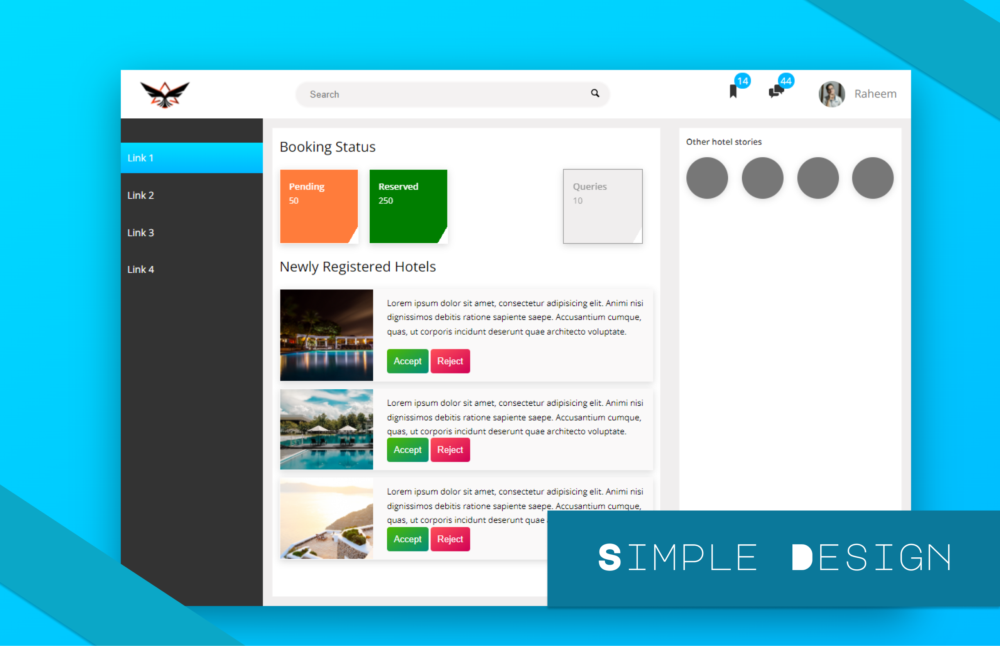

# Simple Design

This is simple design project or we can say landing page did for fun, with modern design, and also this is responsive

## Design Screenshot

## Tech Stack - We used
1. Node, 
2. HTML5, 
3. Sass

## Follow below step for run the dev server
1. Clone the project
2. Install NodeJS if doesn't installed
3. Do `Npm install`
4. run this command for up the dev server `npm run start`

## References
1. [iconmoon](https://icomoon.io/)
2. [caniuse](https://caniuse.com/)
3. [cubic-bezier](https://cubic-bezier.com/#.17,.67,.83,.67)
4. [NodeJS](https://nodejs.org/en/)
5. [Sass](https://sass-lang.com/)
